# Toy Problem Overview

The first part of the project focusses on a toy problem to illustrate the core concepts of the AMR-Hub framework. We make minimal but informed assumptions about the for the forms of input data and try to construct a simple and flexible data-structure to represent the problem.

## The Overall Problem Setup

In general, a standard modelling workflow can be represented as follows:

```mermaid
flowchart LR
    A[📥 Inputs] --> B[🧠 Model]
    B --> C[📊 Predictions]
    C --> D[✅ Verification and Prediction Assessment]
    D --> A

    %% Optional annotation
    D -->|Feedback & Updates| B
```



In the AMR-Hub framework, we expect each of these compoments to be broken down as follows:

### Inputs (📥)

- Architectural Data: Building layouts
- Movement Data: Sparse and Continuous time data
- Disease Data: Infection characteristics, Resistance profiles
- Model Assumptions and Parameters: Transmission rates, Movement patterns, and other relevant parameters

### Model (🧠)

- Representation of the environment (e.g., building layout, rooms, corridors)
- Representation of agents (e.g., individuals, their states, and behaviors)
- Representation of tasks (e.g., cleaning, maintenance, patient care)
- Simulation engine to model movement, interactions, and disease spread
- Possible changes to the environment or agent behaviors over time

### Predictions (📊)

- Agent movement patterns
- Task completion rates
- Infection spread over time
- Environmental contamination levels

### Verification and Prediction Assessment (✅)

- Evaluation of task completion against actual records
- Comparison of predicted movement patterns with observed data
- Assessment of infection spread predictions against real outbreak data
- Analysis of environmental contamination predictions with sensor data

## The Toy Problem Setup (Upto now) 🧩

The toy problem aims to simulate a part of the above workflow with simplified assumptions and data structures. The focus is on creating a minimal yet functional representation of the problem to demonstrate the capabilities of the AMR-Hub framework.

There are certains parts of the problem completely left out for now, such as the disease spread, verification and prediction assessment part, and environmental contamination predictions. The focus is on building a flexible and extensible framework using core Python data-structures and classes, which can be easily expanded to include more complex features in the future.

Focus is also on creating a modular design where different components (e.g., environment representation, agent behaviors, task management) can be developed and tested independently before integrating them into a complete simulation model.

!!! info
**The Toy Problem:** Given a simple building layout with a Ward, a Corridor, and a Staff Room, simulate the movement of a health care worker who attends to patients in the Ward and takes breaks in the Staff Room, while completing assigned tasks over a specified time period.

### The Input Data Format 📥

The toy-problem uses three input files in YAML and CSV formats to define the parameters of the model, the environment, and the movement data of the agents. These files are located in the `tests/inputs/` directory.

The model parameters are defined in the `simulation_config.yml` file:

```yaml
--8<-- "tests/inputs/simulation_config.yml"
```

So, in addition to the simulation related parameters, we also point to the other two input files here.

The environment layout is defined in the `buildings.yml` file:

```yaml
--8<-- "tests/inputs/buildings.yml"
```

This file describes the building layout, including rooms, their types, and connections. This structure of building --> floors --> rooms --> contents is also checked in code for consistency. In future, we would like to convert the CAD files of building layouts into this YAML format automatically.

The movement data of the agents is defined in the `location_timeseries.csv` file:

```csv
--8<-- "tests/inputs/location_timeseries.csv"
```

This CSV file contains timestamped location data for the agents, which will be used to simulate their movement within the building. In the code, this is used also to create agents and initiate their task-lists (explained later).

### The Model Structure 🧠

The core forward model is structured around a few key classes and functions that represent the main components of the simulation. The overall flow of data and interactions between these components can be visualized as follows:


```python
--8<-- "src/amr_hub_abm/simulation.py:Simulation"
```

#### Building

The space in which the agents operate and consists of a list of `Building` objects, which in turn contain `Floor` and `Room` objects. The `Room` is a key component, as it holds information about the room type, its connections to other rooms via `Door` objects, and any `Component` objects (yet to be implemented) present in the room (e.g., beds, desks).


```python
--8<-- "src/amr_hub_abm/space/room.py:Room"
```

#### Door

The `Door` class represents the connections between rooms within the environment. Each door has attributes such as door ID, connected rooms, and door type (e.g., standard, fire exit). The door management system allows for defining how agents can move between different rooms based on the building layout.

```python
--8<-- "src/amr_hub_abm/space/door.py:Door"
```

The `Door` class inherits from the `DetachedDoor` class, which encapsulates the basic properties of a door without any room connections. This separation allows for more flexible door management and easier handling of door attributes.

```python
--8<-- "src/amr_hub_abm/space/door.py:DetachedDoor"
```

#### Agent

The `Agent` class represents the individuals moving within the environment. Each agent has attributes such as ID, type (e.g., healthcare worker), current location, and a list of assigned `Task` objects. The agent's behavior is defined by methods defined in the `Task` list that allow it to move between rooms, perform the tasks, and update its state based on the simulation parameters.


```python
--8<-- "src/amr_hub_abm/agent.py:Agent"
```

#### Task

The `Task` class encapsulates the actions that agents need to perform within the environment. Each task has attributes such as task type (e.g., attend patient, take break), associated room, start and end times, and status (e.g., pending, in-progress, completed). The task management system allows for scheduling, execution, and tracking of tasks assigned to agents.


```python
--8<-- "src/amr_hub_abm/task.py:Task"
```

### Simulation Execution

Once the space and agents are set up, the simulation can be executed using the `Simulation` class. The simulation runs for a specified duration, updating the state of agents and tasks at each time step based on the defined parameters and interactions.

For each time step,

1. Each health care worker agent checks their assigned tasks.
2. The agent estimates the time required to reach the task location based on their movement speed and current position.
3. If the agent can reach the task location within the current time step, they move to the location and perform the task.
4. The task status is updated to "in-progress" or "completed" based on the agent's actions.

### Results and Outputs 📊

Currently, the output and visualisation components are under development. As of now, we can plot the floor layout of the building and the positions of the agents at different time steps using Matplotlib.
